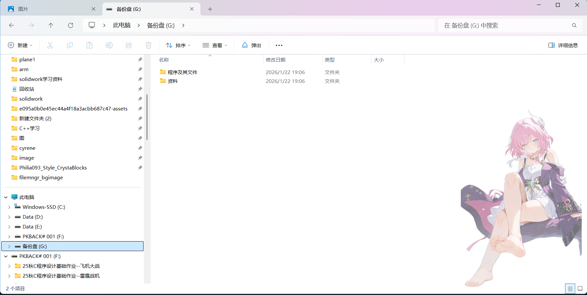

# filemngr_bgimage
FileMngr_BGImage 是一个基于 Windows C++ (Win32 API) 开发的实用工具，旨在为 Windows 资源管理器（File Explorer）添加自定义的透明背景贴图。  程序通过创建一个不可点击、完全透明的覆盖窗口（Overlay Window），实时追踪资源管理器的位置和大小，并将用户指定的 PNG 图片绘制在资源管理器右下角，实现“伪背景”效果。
将您希望生成在资源管理器上方的图片放置在image文件夹内，并改名为source.png即可，您可以在任务管理器搜索名为filemngr_bgimage.exe的进程，它的资源占用是极小的
您可以选择alt+q+t退出，也可以使用您的方式结束其进程

